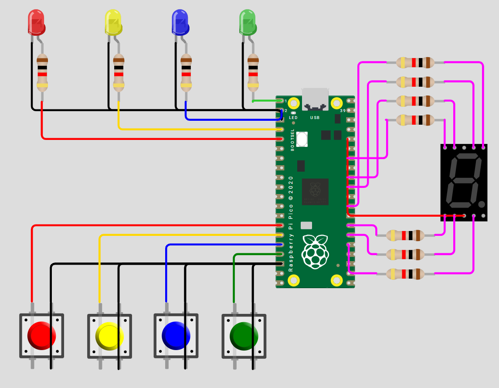

# 🔴🟡🔵🟢 Simón Dice (4 colores) – RP Pico 2
> Selene Román Celis - 22/09/2025 

## Qué debe hacer

Construir un juego Simón Dice de 4 colores en Raspberry Pi Pico 2.

- La secuencia crece +1 por ronda, de 1 hasta 15.

- La persona jugadora debe repetir la secuencia con 4 botones dentro de un tiempo límite por ronda.

- Tiempo límite por ronda (fase de entrada): TL = longitud + 5 segundos (p. ej., Ronda 7 → 12 s).

- Puntaje (0–15): mostrar la máxima ronda alcanzada en un display de 7 segmentos en hex (0–9, A, b, C, d, E, F).

- Aleatoriedad obligatoria: la secuencia debe ser impredecible en cada ejecución.

**Reglas del juego (obligatorias)**

1. **Encendido/Reset:** el 7 segmentos muestra “0” y queda en espera de Start (cualquier botón permite iniciar).

2. **Reproducción:** mostrar la secuencia actual (LEDs uno por uno con separación clara).

3. **Entrada:** al terminar la reproducción, la persona debe repetir la secuencia completa dentro de TL.

4. **Fallo (Game Over):** botón incorrecto, falta/extra de entradas o exceder TL.

5. **Progresión:** si acierta, puntaje = número de ronda, agrega 1 color aleatorio y avanza.

6. **Fin:** al fallar o completar la Ronda 15. Mostrar puntaje final en 7 segmentos (hex).

## Código

```C++ 

#include "pico/stdlib.h"
#include "hardware/structs/sio.h"
#include "pico/time.h"
#include <stdlib.h>
#include <stdio.h>

#define LED_0 0
#define LED_1 1
#define LED_2 4
#define LED_3 5

#define B_0 15
#define B_1 14
#define B_2 13
#define B_3 12

#define SEG_A 18
#define SEG_B 17
#define SEG_C 9
#define SEG_D 10
#define SEG_E 11
#define SEG_F 19
#define SEG_G 20

#define RONDAS 15          // Número de rondas
#define LED_ON 350         // Tiempo de LED encendido
#define LED_OFF 250        // Tiempo entre LEDs
#define PAUSA 800          // Pausa entre rondas
#define TIEMPO 5000        // Tiempo base (5 seg)

// Dígitos hex del display
const uint8_t display[16][7] = {
    {1,1,1,1,1,1,0},{0,1,1,0,0,0,0},{1,1,0,1,1,0,1},{1,1,1,1,0,0,1},
    {0,1,1,0,0,1,1},{1,0,1,1,0,1,1},{1,0,1,1,1,1,1},{1,1,1,0,0,0,0},
    {1,1,1,1,1,1,1},{1,1,1,1,0,1,1},{1,1,1,0,1,1,1},{0,0,1,1,1,1,1},
    {1,0,0,1,1,1,0},{0,1,1,1,1,0,1},{1,0,0,1,1,1,1},{1,0,0,0,1,1,1}
};

const uint8_t pin_display[7] = { SEG_A, SEG_B, SEG_C, SEG_D, SEG_E, SEG_F, SEG_G };
const uint8_t led[4] = { LED_0, LED_1, LED_2, LED_3 };
const uint8_t btn[4] = { B_0, B_1, B_2, B_3 };

// Flancos (1 = no presionado)
int estado_anterior[4] = {1,1,1,1};

// Mostrar en el display
static void digito_display(uint8_t value) {
    value &= 0x0F; // 0-15
    for (int i = 0; i < 7; i++)
        gpio_put(pin_display[i], display[value][i] ? 0 : 1); // 0 
}

// Apagar display
static void display_off(void) {
    for (int i = 0; i < 7; i++) gpio_put(pin_display[i], 1);
}

// Apaga LEDs
static inline void leds_off(void){
    sio_hw->gpio_clr = (1u<<LED_0)|(1u<<LED_1)|(1u<<LED_2)|(1u<<LED_3);
}

static inline void led_o(int in, bool on){
    if (on) sio_hw->gpio_set = (1u<<led[in]);
    else    sio_hw->gpio_clr = (1u<<led[in]);
}

static void parpadeo(int in, int on){
    leds_off();
    led_o(in, true);
    sleep_ms(on);
    leds_off();
}

int boton_flanco(void) {
    for (int i = 0; i < 4; i++) {
        int lectura = gpio_get(btn[i]); 

        if (lectura == 0 && estado_anterior[i] == 1) {
            sleep_ms(40);
            if (gpio_get(btn[i]) == 0) {
                estado_anterior[i] = 0;
                return i;
            } else {
                estado_anterior[i] = 1;
            }
        } else {
            estado_anterior[i] = lectura;
        }
    }
    return -1;
}

int esperar_boton(int tiempo){
    absolute_time_t inicio = get_absolute_time();

    while(1){

        int64_t tiempo_us = absolute_time_diff_us(inicio, get_absolute_time());
        if(tiempo_us >= (int64_t)tiempo*1000) return -1; // Timeout

        int b = boton_flanco();
        if (b != -1) {
            return b;
        }

        sleep_ms(1);
    }
}

// Genera semilla usando tiempo y botón presionado
uint32_t semilla(int btn_i){
    uint32_t t = (uint32_t)(time_us_64() & 0xFFFFFFFF);
    uint32_t seed = t ^ (0x9E3779B1u * (uint32_t)(btn_i + 1));
    if (seed == 0) seed = 0xA5A5A5A5u;
    return seed;
}

int main(void){
    stdio_init_all();

    // Inicializar display
    for (int i = 0; i < 7; i++){
        gpio_init(pin_display[i]);
        gpio_set_dir(pin_display[i], GPIO_OUT);
        gpio_put(pin_display[i], 1); // apagar
    }

    // Inicializar LEDs
    for(int i=0;i<4;i++){
        gpio_init(led[i]);
        gpio_set_dir(led[i], GPIO_OUT);
        gpio_put(led[i],0);
    }
    leds_off();

    // Inicializar botones
    for(int i=0;i<4;i++){
        gpio_init(btn[i]);
        gpio_set_dir(btn[i], GPIO_IN);
        gpio_pull_up(btn[i]);
    }

    for (int i = 0; i < 4; i++) estado_anterior[i] = gpio_get(btn[i]);

    uint8_t secuencia[RONDAS];

    while(true){
        digito_display(0); // Mostrar 0 esperando inicio
        int iniciar = esperar_boton(TIEMPO);
        if(iniciar == -1) continue;
        srand(semilla(iniciar)); // Semilla aleatoria

        bool game_over = false;
        int valor = 0;

        for(int ronda=1; ronda<=RONDAS && !game_over; ronda++){
            valor = ronda - 1;
            digito_display(valor); // Mostrar ronda actual

            for(int i=0;i<ronda;i++)
                secuencia[i] = rand()%4;

            for(int i=0;i<ronda;i++){
                parpadeo(secuencia[i], LED_ON);
                sleep_ms(LED_OFF);
            }

            int ronda_timeout = TIEMPO + (ronda - 1) * 1000;

            int idx = 0;
            while(idx < ronda){
                int b = esperar_boton(ronda_timeout);
                if(b == -1 || b != (int)secuencia[idx]){ // Timeout o error
                    game_over = true;
                    break;
                } else {
                    parpadeo(b, 80); 
                    idx++;
                }
            }

            if(!game_over) sleep_ms(PAUSA);
        }

        // Game over
        while(true){
            digito_display(valor);
            sleep_ms(400);
            display_off();
            sleep_ms(200);

            for(int i=0;i<4;i++){
                if(gpio_get(btn[i]) == 0){
                    leds_off();
                    goto Reiniciar;
                }
            }
        }
Reiniciar:
        continue;
    }

    return 0;
}


```

## Esquemático


## Video
<iframe width="560" height="315" src="https://www.youtube.com/embed/pvvlXd-flwc?si=DTseMd5rA8R7Czjq" title="YouTube video player" frameborder="0" allow="accelerometer; autoplay; clipboard-write; encrypted-media; gyroscope; picture-in-picture; web-share" referrerpolicy="strict-origin-when-cross-origin" allowfullscreen></iframe>