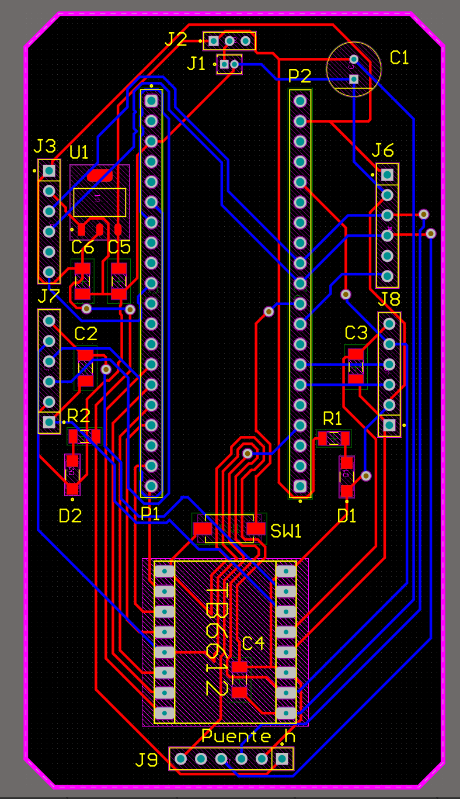

# 🐭 Capstone Micromouse
> Selene Román Celis - 08/12/2025 

## Qué debe hacer

El proyecto Micromouse consiste en diseñar y programar un robot móvil autónomo capaz de explorar un laberinto, construir un mapa y ejecutar una carrera rápida (fast run) desde el inicio hasta el objetivo en el centro.

## Código

```C++
#include <stdio.h>
#include <stdlib.h>
#include <math.h>
#include "pico/stdlib.h"
#include "hardware/pwm.h"
#include "hardware/irq.h"
#include "hardware/i2c.h"
#include "tof.h" 

#define XSHUT_L 22
#define XSHUT_F 3
#define XSHUT_R 7
#define ADDR_L 0x30
#define ADDR_F 0x31
#define ADDR_R 0x32

#define PWMA 10  
#define AIN2 11
#define AIN1 12
#define BIN1 13
#define BIN2 14
#define PWMB 15  
#define ENC_IZQ_C1 21 
#define ENC_DER_C1 5
#define LED_PIN 25 

#define TICKS_GIRO  175     
#define TICKS_CELDA 465     
#define SETPOINT_L  86     
#define SETPOINT_R  61      

#define VEL_EXPLORACION 11500 
#define VEL_SPEED_RUN   16000 
#define VEL_GIRO        14000
#define VEL_LENTO       9000  

#define KP_PARED    25      
#define KD_PARED    350     
#define KP_ENC      30     
#define CLAMP_PID   6000    

#define UMBRAL_PARED_LAT 180 
#define DIST_STOP        50  

#define ANCHO 12
#define ALTO  12

#define NORTE 0
#define ESTE  1
#define SUR   2
#define OESTE 3

#define PARED_N 1
#define PARED_E 2
#define PARED_S 4
#define PARED_W 8

typedef struct {
    uint8_t paredes;    
    uint8_t distancia;  
    bool visitada;      
} Celda;

Celda mapa[ANCHO][ALTO];
int robot_x = 0;        
int robot_y = 0;
int orientacion = NORTE; 

typedef struct { int x; int y; } Punto;
Punto cola[ANCHO * ALTO]; 

volatile long ticks_izq = 0;
volatile long ticks_der = 0;

void encoder_callback(uint gpio, uint32_t events) {
    if (gpio == ENC_IZQ_C1) ticks_izq++;
    else if (gpio == ENC_DER_C1) ticks_der++;
}

void init_sensor_individual(uint pin, uint8_t addr) {
    gpio_put(pin, 1); sleep_ms(15);
    tofInit(1, 0x29, 0); vl53l0x_setAddress(addr); sleep_ms(10);
}

void set_motors(int L, int R) {
    if(L>65535) L=65535; if(L<0) L=0;
    if(R>65535) R=65535; if(R<0) R=0;
    gpio_put(AIN1, 1); gpio_put(AIN2, 0); pwm_set_gpio_level(PWMA, L);
    gpio_put(BIN1, 1); gpio_put(BIN2, 0); pwm_set_gpio_level(PWMB, R);
}

void frenar_total() {
    gpio_put(AIN1, 1); gpio_put(AIN2, 1);
    gpio_put(BIN1, 1); gpio_put(BIN2, 1);
    pwm_set_gpio_level(PWMA, 65535); pwm_set_gpio_level(PWMB, 65535);
    sleep_ms(200); set_motors(0, 0); sleep_ms(50);
}

void mover_motores_dir(int velocidad, bool hacia_adelante) {
    if (hacia_adelante) {
        gpio_put(AIN1, 1); gpio_put(AIN2, 0);
        gpio_put(BIN1, 1); gpio_put(BIN2, 0);
    } else {
        gpio_put(AIN1, 0); gpio_put(AIN2, 1);
        gpio_put(BIN1, 0); gpio_put(BIN2, 1);
    }
    pwm_set_gpio_level(PWMA, velocidad);
    pwm_set_gpio_level(PWMB, velocidad);
}

int leer(uint8_t addr) {
    i2cAddress = addr; return tofReadDistance();
}

void setup_system() {
    stdio_init_all();
    gpio_init(LED_PIN); gpio_set_dir(LED_PIN, GPIO_OUT);

    gpio_init(AIN1); gpio_set_dir(AIN1, GPIO_OUT); gpio_init(AIN2); gpio_set_dir(AIN2, GPIO_OUT);
    gpio_init(BIN1); gpio_set_dir(BIN1, GPIO_OUT); gpio_init(BIN2); gpio_set_dir(BIN2, GPIO_OUT);
    gpio_set_function(PWMA, GPIO_FUNC_PWM); gpio_set_function(PWMB, GPIO_FUNC_PWM);
    pwm_set_wrap(pwm_gpio_to_slice_num(PWMA), 65535); pwm_set_wrap(pwm_gpio_to_slice_num(PWMB), 65535);
    pwm_set_enabled(pwm_gpio_to_slice_num(PWMA), true); pwm_set_enabled(pwm_gpio_to_slice_num(PWMB), true);
    
    gpio_init(ENC_IZQ_C1); gpio_set_dir(ENC_IZQ_C1, GPIO_IN);
    gpio_init(ENC_DER_C1); gpio_set_dir(ENC_DER_C1, GPIO_IN);
    gpio_set_irq_enabled_with_callback(ENC_IZQ_C1, GPIO_IRQ_EDGE_RISE, true, &encoder_callback);
    gpio_set_irq_enabled(ENC_DER_C1, GPIO_IRQ_EDGE_RISE, true);
    
    i2c_init(i2c1, 400000);
    gpio_set_function(26, GPIO_FUNC_I2C); gpio_set_function(27, GPIO_FUNC_I2C);
    gpio_pull_up(26); gpio_pull_up(27);
    
    gpio_init(XSHUT_L); gpio_set_dir(XSHUT_L, GPIO_OUT); gpio_put(XSHUT_L, 0);
    gpio_init(XSHUT_F); gpio_set_dir(XSHUT_F, GPIO_OUT); gpio_put(XSHUT_F, 0);
    gpio_init(XSHUT_R); gpio_set_dir(XSHUT_R, GPIO_OUT); gpio_put(XSHUT_R, 0);
    sleep_ms(100);
    
    init_sensor_individual(XSHUT_L, ADDR_L);
    init_sensor_individual(XSHUT_F, ADDR_F);
    init_sensor_individual(XSHUT_R, ADDR_R);
}


void centrar_frente_a_pared() {
    int d_F = leer(ADDR_F);
    
    if (d_F > 0 && d_F < 150) {
        
        unsigned long t_inicio = to_ms_since_boot(get_absolute_time());
        
        while (abs(d_F - DIST_STOP) > 2) {
            
            if (to_ms_since_boot(get_absolute_time()) - t_inicio > 1000) break;

            d_F = leer(ADDR_F);
            if (d_F <= 0 || d_F > 160) break; 

            if (d_F < DIST_STOP) mover_motores_dir(VEL_LENTO, false); 
            else mover_motores_dir(VEL_LENTO, true);  
            
            sleep_ms(10);
        }
        frenar_total();
    
        ticks_izq = 0; ticks_der = 0; 
    }
}

void avanzar_celda_pid(int velocidad_objetivo) {
    ticks_izq = 0; ticks_der = 0;
    int last_error = 0;
    
    long ticks_limite = TICKS_CELDA;
    if (velocidad_objetivo > 13000) ticks_limite -= 30; 

    while ((ticks_izq + ticks_der) / 2 < ticks_limite) {
        int d_L = leer(ADDR_L); 
        int d_R = leer(ADDR_R); 
        int d_F = leer(ADDR_F);

        int dist_frenado = (velocidad_objetivo > 13000) ? 70 : 45;
        if (d_F < dist_frenado && d_F > 0) break;

    
        int error = 0;
        bool pared_izq = (d_L < UMBRAL_PARED_LAT && d_L > 0);
        bool pared_der = (d_R < UMBRAL_PARED_LAT && d_R > 0);
        bool usar_paredes = true;

        if (pared_izq && pared_der) {
    
            error = (d_L - SETPOINT_L) - (d_R - SETPOINT_R);
        } 
        else if (pared_izq) {
            
            error = (d_L - SETPOINT_L) * 2;
        } 
        else if (pared_der) {
        
            error = (SETPOINT_R - d_R) * 2;
        } 
        else {
    
            usar_paredes = false;
            error = (ticks_izq - ticks_der) * KP_ENC; 
        }

        if (abs(error) < 4) error = 0;

        int P = error * KP_PARED;
        int D = (error - last_error) * KD_PARED;
        if (!usar_paredes) D = 0; 

        last_error = error;
        
        int correction = P + D;
        if (correction > CLAMP_PID) correction = CLAMP_PID;
        if (correction < -CLAMP_PID) correction = -CLAMP_PID;

        set_motors(velocidad_objetivo - correction, velocidad_objetivo + correction);
    }
    
    set_motors(0, 0); 
    sleep_ms(velocidad_objetivo > 13000 ? 10 : 50); 
}

void girar_estatico(bool derecha) {
    ticks_izq = 0; ticks_der = 0;
    while ((ticks_izq + ticks_der) / 2 < TICKS_GIRO) {
        if(derecha) {
            gpio_put(AIN1, 1); gpio_put(AIN2, 0); pwm_set_gpio_level(PWMA, VEL_GIRO);
            gpio_put(BIN1, 0); gpio_put(BIN2, 1); pwm_set_gpio_level(PWMB, VEL_GIRO);
        } else {
            gpio_put(AIN1, 0); gpio_put(AIN2, 1); pwm_set_gpio_level(PWMA, VEL_GIRO);
            gpio_put(BIN1, 1); gpio_put(BIN2, 0); pwm_set_gpio_level(PWMB, VEL_GIRO);
        }
    }
    frenar_total();
}

void init_mapa() {
    for(int x=0; x<ANCHO; x++) {
        for(int y=0; y<ALTO; y++) {
            mapa[x][y].paredes = 0;
            mapa[x][y].distancia = 255; 
            mapa[x][y].visitada = false;
        }
    }
    for(int x=0; x<ANCHO; x++) { mapa[x][0].paredes |= PARED_S; mapa[x][ALTO-1].paredes |= PARED_N; }
    for(int y=0; y<ALTO; y++) { mapa[0][y].paredes |= PARED_W; mapa[ANCHO-1][y].paredes |= PARED_E; }
    
    mapa[0][0].visitada = true;
}

void actualizar_flood_fill(bool modo_estricto) {

    for(int x=0; x<ANCHO; x++) 
        for(int y=0; y<ALTO; y++) 
            mapa[x][y].distancia = 255;

 
    mapa[5][5].distancia = 0; cola[0] = (Punto){5,5};
    mapa[5][6].distancia = 0; cola[1] = (Punto){5,6};
    mapa[6][5].distancia = 0; cola[2] = (Punto){6,5};
    mapa[6][6].distancia = 0; cola[3] = (Punto){6,6};

    int head = 0; int tail = 4; 

    while(head < tail) {
        Punto actual = cola[head++];
        uint8_t dist_vecino = mapa[actual.x][actual.y].distancia + 1;
        
        if (actual.y < ALTO-1 && !(mapa[actual.x][actual.y].paredes & PARED_N)) {
            if (!modo_estricto || mapa[actual.x][actual.y+1].visitada) { 
                if (mapa[actual.x][actual.y+1].distancia == 255) {
                    mapa[actual.x][actual.y+1].distancia = dist_vecino;
                    cola[tail++] = (Punto){actual.x, actual.y+1};
                }
            }
        }
        if (actual.y > 0 && !(mapa[actual.x][actual.y].paredes & PARED_S)) {
            if (!modo_estricto || mapa[actual.x][actual.y-1].visitada) {
                if (mapa[actual.x][actual.y-1].distancia == 255) {
                    mapa[actual.x][actual.y-1].distancia = dist_vecino;
                    cola[tail++] = (Punto){actual.x, actual.y-1};
                }
            }
        }

        if (actual.x < ANCHO-1 && !(mapa[actual.x][actual.y].paredes & PARED_E)) {
            if (!modo_estricto || mapa[actual.x+1][actual.y].visitada) {
                if (mapa[actual.x+1][actual.y].distancia == 255) {
                    mapa[actual.x+1][actual.y].distancia = dist_vecino;
                    cola[tail++] = (Punto){actual.x+1, actual.y};
                }
            }
        }

        if (actual.x > 0 && !(mapa[actual.x][actual.y].paredes & PARED_W)) {
            if (!modo_estricto || mapa[actual.x-1][actual.y].visitada) {
                if (mapa[actual.x-1][actual.y].distancia == 255) {
                    mapa[actual.x-1][actual.y].distancia = dist_vecino;
                    cola[tail++] = (Punto){actual.x-1, actual.y};
                }
            }
        }
    }
}

void actualizar_paredes(int dir, bool existe) {
    if (dir == NORTE && robot_y < ALTO-1) {
        if(existe) { mapa[robot_x][robot_y].paredes |= PARED_N; mapa[robot_x][robot_y+1].paredes |= PARED_S; }
    }
    else if (dir == SUR && robot_y > 0) {
        if(existe) { mapa[robot_x][robot_y].paredes |= PARED_S; mapa[robot_x][robot_y-1].paredes |= PARED_N; }
    }
    else if (dir == ESTE && robot_x < ANCHO-1) {
        if(existe) { mapa[robot_x][robot_y].paredes |= PARED_E; mapa[robot_x+1][robot_y].paredes |= PARED_W; }
    }
    else if (dir == OESTE && robot_x > 0) {
        if(existe) { mapa[robot_x][robot_y].paredes |= PARED_W; mapa[robot_x-1][robot_y].paredes |= PARED_E; }
    }
}

void escanear_paredes() {
    int f = leer(ADDR_F);
    int r = leer(ADDR_R);
    int l = leer(ADDR_L);
    
    bool hay_f = (f < UMBRAL_PARED_LAT && f > 0);
    bool hay_r = (r < UMBRAL_PARED_LAT && r > 0);
    bool hay_l = (l < UMBRAL_PARED_LAT && l > 0);

    if(hay_f) actualizar_paredes(orientacion, true);
    if(hay_r) actualizar_paredes((orientacion + 1) % 4, true);
    if(hay_l) actualizar_paredes((orientacion + 3) % 4, true);
    
    mapa[robot_x][robot_y].visitada = true;
}

void ejecutar_speed_run() {
    printf("\n--- MODO SPEED RUN ACTIVADO ---\n");
    printf("TIENES 10 SEG PARA PONERME EN (0,0) NORTE\n");
    
    for(int i=0; i<10; i++) {
        gpio_put(LED_PIN, 1); sleep_ms(200);
        gpio_put(LED_PIN, 0); sleep_ms(800);
    }
    
    for(int i=0; i<5; i++) { gpio_put(LED_PIN, 1); sleep_ms(50); gpio_put(LED_PIN, 0); sleep_ms(50); }

    robot_x = 0; robot_y = 0; orientacion = NORTE;
    
    actualizar_flood_fill(true);

    while(1) {
     
        if (mapa[robot_x][robot_y].distancia == 0) {
            frenar_total();
            printf("SPEED RUN COMPLETADO!!\n");
            while(1) { gpio_put(LED_PIN, 1); sleep_ms(100); gpio_put(LED_PIN, 0); sleep_ms(100); }
        }

        int min_dist = 255;
        int mejor_dir = -1;

       
        if (!(mapa[robot_x][robot_y].paredes & PARED_N) && robot_y < ALTO-1) 
            if (mapa[robot_x][robot_y+1].distancia < min_dist) { min_dist = mapa[robot_x][robot_y+1].distancia; mejor_dir = NORTE; }

        if (!(mapa[robot_x][robot_y].paredes & PARED_E) && robot_x < ANCHO-1) 
            if (mapa[robot_x+1][robot_y].distancia < min_dist) { min_dist = mapa[robot_x+1][robot_y].distancia; mejor_dir = ESTE; }
        
        if (!(mapa[robot_x][robot_y].paredes & PARED_S) && robot_y > 0) 
            if (mapa[robot_x][robot_y-1].distancia < min_dist) { min_dist = mapa[robot_x][robot_y-1].distancia; mejor_dir = SUR; }
        
        if (!(mapa[robot_x][robot_y].paredes & PARED_W) && robot_x > 0) 
            if (mapa[robot_x-1][robot_y].distancia < min_dist) { min_dist = mapa[robot_x-1][robot_y].distancia; mejor_dir = OESTE; }

        if (mejor_dir == -1) {
            frenar_total();
            printf("ERROR: RUTA BLOQUEADA EN SPEED RUN\n"); break;
        }

        centrar_frente_a_pared(); 

        int diferencia = (mejor_dir - orientacion + 4) % 4;
        if (diferencia == 1) { girar_estatico(true); orientacion = (orientacion + 1) % 4; }
        else if (diferencia == 3) { girar_estatico(false); orientacion = (orientacion + 3) % 4; }
        else if (diferencia == 2) { girar_estatico(true); girar_estatico(true); orientacion = (orientacion + 2) % 4; }

        avanzar_celda_pid(VEL_SPEED_RUN);

        if (orientacion == NORTE) robot_y++;
        else if (orientacion == SUR) robot_y--;
        else if (orientacion == ESTE) robot_x++;
        else if (orientacion == OESTE) robot_x--;
    }
}

int main() {
    setup_system();
    init_mapa();
    sleep_ms(3000); 
    
    printf("--- FASE 1: EXPLORACION ---\n");

    while (1) {
        escanear_paredes();
        actualizar_flood_fill(false); 


        if (mapa[robot_x][robot_y].distancia == 0) {
            frenar_total();
            printf("META ENCONTRADA. PREPARANDO FASE 2...\n");
            
            for(int i=0; i<4; i++) { girar_estatico(true); }
            
            ejecutar_speed_run(); 
            break; 
        }

        uint8_t min_dist = 255;
        
        if (!(mapa[robot_x][robot_y].paredes & PARED_N) && robot_y < ALTO-1) if (mapa[robot_x][robot_y+1].distancia < min_dist) min_dist = mapa[robot_x][robot_y+1].distancia;
        if (!(mapa[robot_x][robot_y].paredes & PARED_E) && robot_x < ANCHO-1) if (mapa[robot_x+1][robot_y].distancia < min_dist) min_dist = mapa[robot_x+1][robot_y].distancia;
        if (!(mapa[robot_x][robot_y].paredes & PARED_S) && robot_y > 0) if (mapa[robot_x][robot_y-1].distancia < min_dist) min_dist = mapa[robot_x][robot_y-1].distancia;
        if (!(mapa[robot_x][robot_y].paredes & PARED_W) && robot_x > 0) if (mapa[robot_x-1][robot_y].distancia < min_dist) min_dist = mapa[robot_x-1][robot_y].distancia;

        int intentos[4] = {orientacion, (orientacion+1)%4, (orientacion+3)%4, (orientacion+2)%4};
        int mejor_dir = -1;
        bool encontrado_nuevo = false;

        for(int i=0; i<4; i++) {
            int dir = intentos[i];
            int nx = robot_x, ny = robot_y;
            bool pared = false;
            if (dir==NORTE) { ny++; pared = (mapa[robot_x][robot_y].paredes & PARED_N); }
            else if (dir==ESTE) { nx++; pared = (mapa[robot_x][robot_y].paredes & PARED_E); }
            else if (dir==SUR) { ny--; pared = (mapa[robot_x][robot_y].paredes & PARED_S); }
            else if (dir==OESTE) { nx--; pared = (mapa[robot_x][robot_y].paredes & PARED_W); }

            if (nx >= 0 && nx < ANCHO && ny >= 0 && ny < ALTO && !pared) {
                if (mapa[nx][ny].distancia == min_dist && !mapa[nx][ny].visitada) {
                    mejor_dir = dir; encontrado_nuevo = true; break;
                }
            }
        }
        if (!encontrado_nuevo) {
            for(int i=0; i<4; i++) {
                int dir = intentos[i];
                int nx = robot_x, ny = robot_y;
                bool pared = false;
                if (dir==NORTE) { ny++; pared = (mapa[robot_x][robot_y].paredes & PARED_N); }
                else if (dir==ESTE) { nx++; pared = (mapa[robot_x][robot_y].paredes & PARED_E); }
                else if (dir==SUR) { ny--; pared = (mapa[robot_x][robot_y].paredes & PARED_S); }
                else if (dir==OESTE) { nx--; pared = (mapa[robot_x][robot_y].paredes & PARED_W); }

                if (nx >= 0 && nx < ANCHO && ny >= 0 && ny < ALTO && !pared) {
                    if (mapa[nx][ny].distancia == min_dist) { mejor_dir = dir; break; }
                }
            }
        }


        centrar_frente_a_pared();

        if (mejor_dir == -1) {
            girar_estatico(true); girar_estatico(true);
            orientacion = (orientacion + 2) % 4;
        } else {
            int diferencia = (mejor_dir - orientacion + 4) % 4;
            if (diferencia == 1) { girar_estatico(true); orientacion = (orientacion + 1) % 4; }
            else if (diferencia == 3) { girar_estatico(false); orientacion = (orientacion + 3) % 4; }
            else if (diferencia == 2) { girar_estatico(true); girar_estatico(true); orientacion = (orientacion + 2) % 4; }
        }

        avanzar_celda_pid(VEL_EXPLORACION);

        if (orientacion == NORTE) robot_y++;
        else if (orientacion == SUR) robot_y--;
        else if (orientacion == ESTE) robot_x++;
        else if (orientacion == OESTE) robot_x--;
        
        sleep_ms(50);
    }
    return 0;
}
```

## Esquema


## Video
<iframe width="560" height="315" src="https://www.youtube.com/embed/wi76ptIx5JI?si=VE3xT04nDbx6S7Gz" title="YouTube video player" frameborder="0" allow="accelerometer; autoplay; clipboard-write; encrypted-media; gyroscope; picture-in-picture; web-share" referrerpolicy="strict-origin-when-cross-origin" allowfullscreen></iframe>
