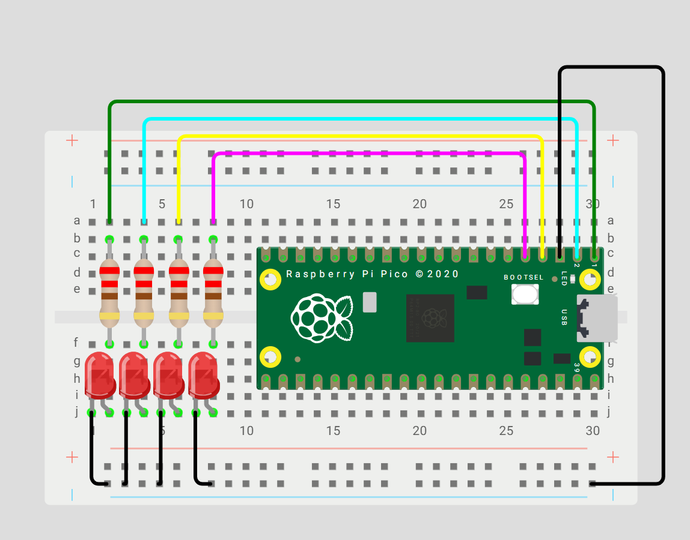

#  🎲 Contador binario 4 bits

> Selene Román Celis - 27/08/2025


## Que debe hacer
En cuatro leds debe mostrarse cada segundo la representación binaria del 0 al 15.
 
``` codigo
#include "pico/stdlib.h"
 
#define PIN_A 0
#define PIN_B 1
#define PIN_C 2
#define PIN_D 3
 
int main() {
 
   // Máscara
   const uint32_t MASK = (1u<<PIN_A) | (1u<<PIN_B) | (1u<<PIN_C) | (1u<<PIN_D);
 
   gpio_init_mask(MASK);
   gpio_set_dir_out_masked(MASK);
 
   while (true) {
       for (int i = 0; i < 16; i++) {   // Cuenta de 0 a 15
           gpio_put_masked(MASK, i << PIN_A);
 
           sleep_ms(1000);                  
       }
   }
}
```
## Esquematico

 
 
## Video
 
<iframe width="560" height="315" src="https://www.youtube.com/embed/Man1uiNQgQg?si=1-MrveGR_90Mh2ag" title="YouTube video player" frameborder="0" allow="accelerometer; autoplay; clipboard-write; encrypted-media; gyroscope; picture-in-picture; web-share" referrerpolicy="strict-origin-when-cross-origin" allowfullscreen></iframe>