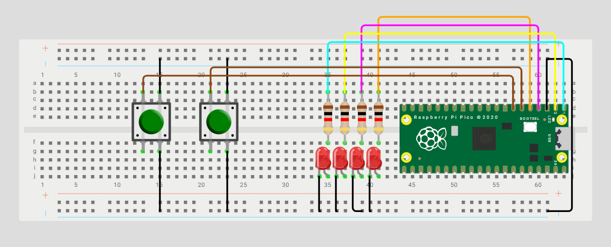

# 🕹️ Selector cíclico de 4 LEDs con avance/retroceso

> Selene Román Celis - 01/09/2025 

## Qué debe hacer
Con dos botones A y B (pull-up; presionado=0) enciende tres LEDs que muestren en paralelo los resultados de AND, OR y XOR. En el video muestra las 4 combinaciones (00, 01, 10, 11).

``` codigo
#include "pico/stdlib.h"
 
#define LED0 0
#define LED1 1
#define LED2 2
#define LED3 3
#define B_AV 4
#define B_RE 5
 
int main() {
    // Máscara
    const uint32_t LEDS_MASK = (1u<<LED0) | (1u<<LED1) | (1u<<LED2) | (1u<<LED3);
 
    gpio_init(LED0);
    gpio_init(LED1);
    gpio_init(LED2);
    gpio_init(LED3);
    gpio_set_dir(LED0, true);
    gpio_set_dir(LED1, true);
    gpio_set_dir(LED2, true);
    gpio_set_dir(LED3, true);
 
    gpio_init(B_AV);
    gpio_init(B_RE);
    gpio_set_dir(B_AV, false);
    gpio_set_dir(B_RE, false);
    gpio_pull_up(B_AV);
    gpio_pull_up(B_RE);
 
    int pos = 0;        
    int estadoAV = 1;   // Estado previo botón A
    int estadoRE = 1;   // Estado previo botón B
 
    while (true) {
     
        gpio_put_masked(LEDS_MASK, (1u << pos));
 
        if (gpio_get(B_AV) == 0 && estadoAV == 1) {
            pos++;
            if (pos > 3) pos = 0;
        }
        else if (gpio_get(B_RE) == 0 && estadoRE == 1) {
            pos--;
            if (pos < 0) pos = 3;
        }
        // Guardar estado
        estadoAV = gpio_get(B_AV);
        estadoRE = gpio_get(B_RE);
 
        sleep_ms(20);
    }
}
```
## Esquemático


## Video
<iframe width="560" height="315" src="https://www.youtube.com/embed/tVQgv4xvnJc?si=f9M6IhCKlwHLMtzb" title="YouTube video player" frameborder="0" allow="accelerometer; autoplay; clipboard-write; encrypted-media; gyroscope; picture-in-picture; web-share" referrerpolicy="strict-origin-when-cross-origin" allowfullscreen></iframe>