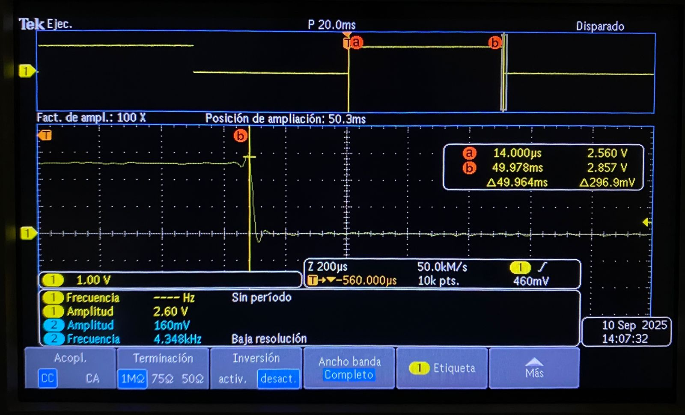

# ⏱️🔄 Comparar jitter/precisión con osciloscopio: modo µs vs modo ciclos
> Selene Román Celis - 15/09/2025 

## Qué debe hacer

Genera una señal por toggle en la ISR de ALARM0, primero en modo µs y luego en modo ciclos de clk_sys (mismo periodo nominal). En ambos casos:

*   Usa rearme acumulativo.

*   Mantén el resto del código idéntico.

*   Con el osciloscopio, mide y registra para cada modo:

    - Periodo promedio y desviación respecto al nominal.
    - Jitter pico-a-pico y/o RMS.
    - Compara resultados y discute el compromiso entre resolución de tick y horizonte de programación.

## Código modo µs

```C++
// Blink con timer (SDK alto nivel): cambia BLINK_MS para ajustar
#include "pico/stdlib.h"
#include "pico/time.h"

#define LED_PIN 0
static const int BLINK_MS = 50; 

bool blink_cb(repeating_timer_t *t) {
    static bool on = false;
    gpio_put(LED_PIN, on = !on);
    return true; // seguir repitiendo la alarma
}

int main() {
    stdio_init_all();

    gpio_init(LED_PIN);
    gpio_set_dir(LED_PIN, true);

    repeating_timer_t timer;
    // Programa una interrupción periódica cada BLINK_MS:
    add_repeating_timer_ms(BLINK_MS, blink_cb, NULL, &timer);

    while (true) {
        // El trabajo "pesado" debería ir aquí (no en la ISR).
        tight_loop_contents();
    }
}
```

## Código modo ciclos

```C++
// Blink con timer de sistema (bajo nivel): programando ALARM0 e IRQ
#include "pico/stdlib.h"
#include "hardware/irq.h"
#include "hardware/structs/timer.h"

#define LED_PIN       0
#define ALARM_NUM     0 

// Calcula el número de IRQ para esa alarma 
#define ALARM_IRQ     timer_hardware_alarm_get_irq_num(timer_hw, ALARM_NUM)

static volatile uint32_t next_deadline;   // próximo instante (en us) en 32 bits bajos
// Por defecto el timer cuenta µs (no cambiamos la fuente).
static volatile uint32_t intervalo_us = 50000u;    // periodo en microsegundos

void on_alarm_irq(void) {
    // 1. Limpiar el flag de la alarma
    hw_clear_bits(&timer_hw->intr, 1u << ALARM_NUM);

    // 2. Hacer el trabajo toggle LED
    sio_hw->gpio_togl = 1u << LED_PIN;

    // 3. Rearmar la siguiente alarma con "deadline acumulativo"
    next_deadline += intervalo_us;
    timer_hw->alarm[ALARM_NUM] = next_deadline;
}

int main() {
    stdio_init_all();

    // Configura el LED
    gpio_init(LED_PIN);
    gpio_set_dir(LED_PIN, true);

    // "now" = 32 bits bajos del contador (tiempo en µs)
    uint32_t now_us = timer_hw->timerawl;          // lectura 32b (low) del contador
    next_deadline = now_us + intervalo_us;         // primer deadline

    // Programa la alarma
    timer_hw->alarm[ALARM_NUM] = next_deadline;

    // Crea un handler exclusivo para ligar el callback a la IRQ de la alarma
    irq_set_exclusive_handler(ALARM_IRQ, on_alarm_irq);
    // Habilita dentro del periférico TIMER la fuente de interrupción para la alarma ALARM_NUM inte = interrupt enable
    hw_set_bits(&timer_hw->inte, 1u << ALARM_NUM);
    //Habilita la IRQ en el NVIC (controlador de interrupciones del núcleo)
    irq_set_enabled(ALARM_IRQ, true);

    while (true) {
        // Mantén el bucle principal libre; lo pesado va aquí, no en la ISR
        tight_loop_contents();
    }
}
```

Se generó una señal cuadrada mediante el toggle de un pin en la ISR de ALARM0, empleando rearme acumulativo. Se programó el mismo periodo nominal en dos configuraciones:

1. Modo µs (resolución en microsegundos).

2. Modo ciclos de clk_sys (resolución en ciclos de reloj).

En ambos casos se mantuvo idéntico el resto del código.

## Esquema modo µs


## Esquema modo ciclos


### Resultado de medición con osciloscopio

1. **Modo µs**
    * **Periodo nominal configurado:** 50 ms
    * **Periodo promedio medido:** 49.94 ms
    * **Desviación:** ~1.1%
    * **Jitter pico-a-pico:** ~560 µs
---
2. **Modo ciclos**
    * **Periodo nominal configurado:** 50 000 (Periodo en ms)
    * **Periodo promedio medido:** 49.96 ms
    * **Desviación:** ~0.08%
    * **Jitter pico-a-pico:** ~14 µs

En modo µs, el temporizador está limitado por la resolución del tick de microsegundo. Esto produce un jitter más grande. La ventaja es que permite programar periodos largos sin desbordar el contador.

En modo ciclos, la resolución es mucho más fina. El resultado es un jitter significativamente menor y una desviación más pequeña respecto al periodo nominal. Sin embargo, el horizonte de programación es más corto, el contador puede desbordarse más rápido si se intentan programar retardos largos únicamente con ciclos.