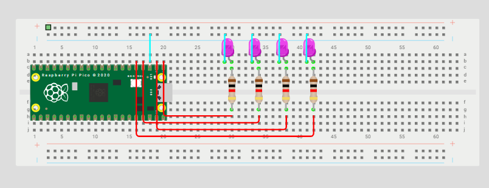

# 💡 Cuatro alarmas / LEDs a distintas frecuencias
> Selene Román Celis - 17/09/2025 

## Qué debe hacer

Configurar ALARM0..ALARM3 del timer de sistema en modo µs. Cada alarma controla un LED distinto con un periodo propio. 

## Código

```C++ 

#include "pico/stdlib.h"
#include "hardware/irq.h"
#include "hardware/structs/timer.h"

#define LED_PIN0      0
#define LED_PIN1      1
#define LED_PIN2      2
#define LED_PIN3      3


#define ALARM_NUM0     0  // usaremos la alarma 0
#define ALARM_NUM1     1
#define ALARM_NUM2     2
#define ALARM_NUM3     3

// Calcula el número de IRQ para esa alarma 
#define ALARM0_IRQ     timer_hardware_alarm_get_irq_num(timer_hw, ALARM_NUM0)

static volatile uint32_t next_deadline[4];   // próximo instante (en us) en 32 bits bajos
// Por defecto el timer cuenta µs (no cambiamos la fuente).
static volatile uint32_t intervalo_us[4]=  { // periodo en microsegundos
    50000u,
    100000u,
    150000u,
    200000u  
};

void on_alarm_irq(void) {
    if (timer_hw->intr & (1u << ALARM_NUM0)) {
        hw_clear_bits(&timer_hw->intr, 1u << ALARM_NUM0);
        sio_hw->gpio_togl = 1u << LED_PIN0;
        next_deadline[0] += intervalo_us[0];
        timer_hw->alarm[ALARM_NUM0] = next_deadline[0];
    }

    if (timer_hw->intr & (1u << ALARM_NUM1)) {
        hw_clear_bits(&timer_hw->intr, 1u << ALARM_NUM1);
        sio_hw->gpio_togl = 1u << LED_PIN1;
        next_deadline[1] += intervalo_us[1];
        timer_hw->alarm[ALARM_NUM1] = next_deadline[1];
    }

    if (timer_hw->intr & (1u << ALARM_NUM2)) {
        hw_clear_bits(&timer_hw->intr, 1u << ALARM_NUM2);
        sio_hw->gpio_togl = 1u << LED_PIN2;
        next_deadline[2] += intervalo_us[2];
        timer_hw->alarm[ALARM_NUM2] = next_deadline[2];
    }

    if (timer_hw->intr & (1u << ALARM_NUM3)) {
        hw_clear_bits(&timer_hw->intr, 1u << ALARM_NUM3);
        sio_hw->gpio_togl = 1u << LED_PIN3;
        next_deadline[3] += intervalo_us[3];
        timer_hw->alarm[ALARM_NUM3] = next_deadline[3];
    }
}

int main() {
    stdio_init_all();

    // Configura el LED
    gpio_init(LED_PIN0);
    gpio_set_dir(LED_PIN0, true);
    gpio_init(LED_PIN1);
    gpio_set_dir(LED_PIN1, true);
    gpio_init(LED_PIN2);
    gpio_set_dir(LED_PIN2, true);
    gpio_init(LED_PIN3);
    gpio_set_dir(LED_PIN3, true);

    // "now" = 32 bits bajos del contador (tiempo en µs)
    uint32_t now_us = timer_hw->timerawl;          // lectura 32b (low) del contador
    
    next_deadline[0] = now_us + intervalo_us[0];
    next_deadline[1] = now_us + intervalo_us[1];
    next_deadline[2] = now_us + intervalo_us[2];
    next_deadline[3] = now_us + intervalo_us[3];      

    // Programa la alarma
    timer_hw->alarm[ALARM_NUM0] = next_deadline[0];
    timer_hw->alarm[ALARM_NUM1] = next_deadline[1];
    timer_hw->alarm[ALARM_NUM2] = next_deadline[2];
    timer_hw->alarm[ALARM_NUM3] = next_deadline[3];

    // Crea un handler exclusivo para ligar el callback a la IRQ de la alarma
    irq_set_exclusive_handler(ALARM0_IRQ, on_alarm_irq);
 
    // Habilita dentro del periférico TIMER la fuente de interrupción para la alarma ALARM_NUM inte = interrupt enable
    hw_set_bits(&timer_hw->inte, 1u << ALARM_NUM0);
    hw_set_bits(&timer_hw->inte, 1u << ALARM_NUM1);
    hw_set_bits(&timer_hw->inte, 1u << ALARM_NUM2);
    hw_set_bits(&timer_hw->inte, 1u << ALARM_NUM3);

   //Habilita la IRQ en el NVIC (controlador de interrupciones del núcleo)
    irq_set_enabled(ALARM0_IRQ, true);

    while (true) {
        // Mantén el bucle principal libre; lo pesado va aquí, no en la ISR
        tight_loop_contents();
    }
}

```

## Esquemático


## Video
<iframe width="560" height="315" src="https://www.youtube.com/embed/mF6rjDa452A?si=MJhPKmeo25mgGrqz" title="YouTube video player" frameborder="0" allow="accelerometer; autoplay; clipboard-write; encrypted-media; gyroscope; picture-in-picture; web-share" referrerpolicy="strict-origin-when-cross-origin" allowfullscreen></iframe>