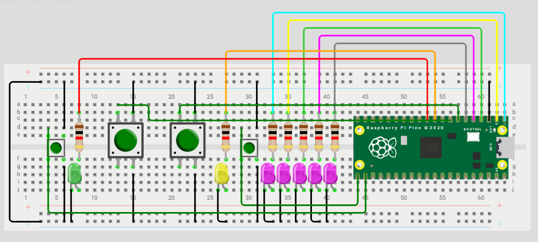

# ⏪⏩️ Mini-Pong 2.0
> Selene Román Celis - 17/09/2025 

## Qué debe hacer

Modificar el Mini-Pong, para tener dos botones adicionales, que suban y bajen la velocidad del juego sin delay.

```C++
#include "pico/stdlib.h"
#include "hardware/irq.h"
#include "hardware/structs/timer.h"
#include "hardware/gpio.h"

#define LED_1 0
#define LED_2 1
#define LED_3 2
#define LED_4 3
#define LED_5 4

#define LED_J1 16
#define LED_J2 17

#define B_D 14
#define B_I 15

#define B_UP 18
#define B_DOWN 19

int led_on = 2;
int direc = 0;
int boton_d = 0;
int boton_i = 0;


int velocidad = 600;
const int MIN = 400;
const int MAX = 1500;
const int Aumento = 50;


#define ALARM1_NUM 1
#define ALARM1_IRQ timer_hardware_alarm_get_irq_num(timer_hw, ALARM1_NUM)
static uint32_t next1;

void botones(uint gpio, uint32_t events) {
    if (gpio == B_D) boton_d = 1;
    if (gpio == B_I) boton_i = 1;
}

static void alarmvel_irq(void) {
    hw_clear_bits(&timer_hw->intr, 1u << ALARM1_NUM);

    int up = gpio_get(B_UP);
    int down = gpio_get(B_DOWN);

    if (!up) { // Aumentar velocidad
        if (velocidad > MIN + Aumento) velocidad -= Aumento;
        else velocidad = MIN;
    }
    if (!down) { // Bajar velocidad
        if (velocidad < MAX - Aumento) velocidad += Aumento;
        else velocidad = MAX;
    }

    next1 += 20000;
    timer_hw->alarm[ALARM1_NUM] = next1;
}

void parpadeo(int led) {
    for (int i = 0; i < 3; i++) {
        gpio_put(led, 1);
        sleep_ms(300);
        gpio_put(led, 0);
        sleep_ms(300);
    }
}

void leds() {
    int leds[] = {LED_1, LED_2, LED_3, LED_4, LED_5, LED_J1, LED_J2};
    for (int i = 0; i < 7; ++i) {
        gpio_init(leds[i]);
        gpio_set_dir(leds[i], GPIO_OUT);
        gpio_put(leds[i], 0);
    }
}

void iniciar_botones() {
    int botones_dir[] = {B_D, B_I};
    for (int i = 0; i < 2; ++i) {
        gpio_init(botones_dir[i]);
        gpio_set_dir(botones_dir[i], GPIO_IN);
        gpio_pull_up(botones_dir[i]);
    }

    gpio_set_irq_enabled_with_callback(B_D, GPIO_IRQ_EDGE_FALL, true, &botones);
    gpio_set_irq_enabled(B_I, GPIO_IRQ_EDGE_FALL, true);
}

void botones_velocidad() {
    int botones_vel[] = {B_UP, B_DOWN};
    for (int i = 0; i < 2; ++i) {
        gpio_init(botones_vel[i]);
        gpio_set_dir(botones_vel[i], GPIO_IN);
        gpio_pull_up(botones_vel[i]);
    }

    timer_hw->source = 0u;
    uint32_t now = timer_hw->timerawl;
    next1 = now + 20000;
    timer_hw->alarm[ALARM1_NUM] = next1;
    hw_clear_bits(&timer_hw->intr, 1u << ALARM1_NUM);
    irq_set_exclusive_handler(ALARM1_IRQ, alarmvel_irq);
    hw_set_bits(&timer_hw->inte, 1u << ALARM1_NUM);
    irq_set_enabled(ALARM1_IRQ, true);
}

int main() {
    stdio_init_all();
    leds();
    iniciar_botones();
    botones_velocidad();

    gpio_put(LED_3, 1);
    while (direc == 0) {
        if (boton_d) { direc = 1; boton_d = 0; gpio_put(LED_3, 0); }
        if (boton_i) { direc = -1; boton_i = 0; gpio_put(LED_3, 0); }
        sleep_ms(10);
    }

    while (true) {
        gpio_put(LED_1, 0); 
        gpio_put(LED_2, 0); 
        gpio_put(LED_3, 0);
        gpio_put(LED_4, 0); 
        gpio_put(LED_5, 0);

        gpio_put(led_on, 1);
        sleep_ms(velocidad);

        if (led_on == LED_1) {
            if (boton_d) direc = 1;
            else { 
                parpadeo(LED_J2); led_on = LED_2; direc = 1; 
            }
            boton_d = 0;
        } 
        else if (led_on == LED_5) {
            if (boton_i) direc = -1;
            else { 
                parpadeo(LED_J1); led_on = LED_4; direc = -1; 
            }
            boton_i = 0;
        }

        led_on += direc;
    }
}

```
## Esquemático


## Video
<iframe width="560" height="315" src="https://www.youtube.com/embed/OJCL1DyxW3k?si=y--uU_nOs69t0vn9" title="YouTube video player" frameborder="0" allow="accelerometer; autoplay; clipboard-write; encrypted-media; gyroscope; picture-in-picture; web-share" referrerpolicy="strict-origin-when-cross-origin" allowfullscreen></iframe>