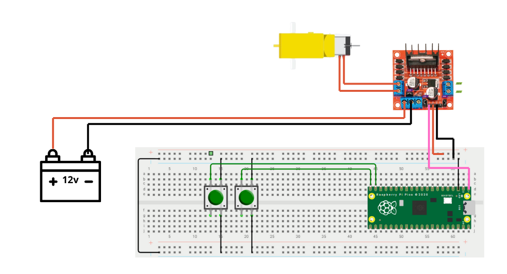

# ⚙️ Control de Duty Cycle — Motor DC
> Selene Román Celis - 01/10/2025 

## Qué debe hacer

- Implementar un circuito con un motor DC controlado mediante PWM variando el duty cycle.

- Usar 2 botones para seleccionar entre 3 velocidades predefinidas (baja, media y alta).

```C++


```
## Esquemático


## Video
<iframe width="560" height="315" src="https://www.youtube.com/embed/27hgnbmd6Wk?si=w_6thkJ4J-pCuQ-1" title="YouTube video player" frameborder="0" allow="accelerometer; autoplay; clipboard-write; encrypted-media; gyroscope; picture-in-picture; web-share" referrerpolicy="strict-origin-when-cross-origin" allowfullscreen></iframe>