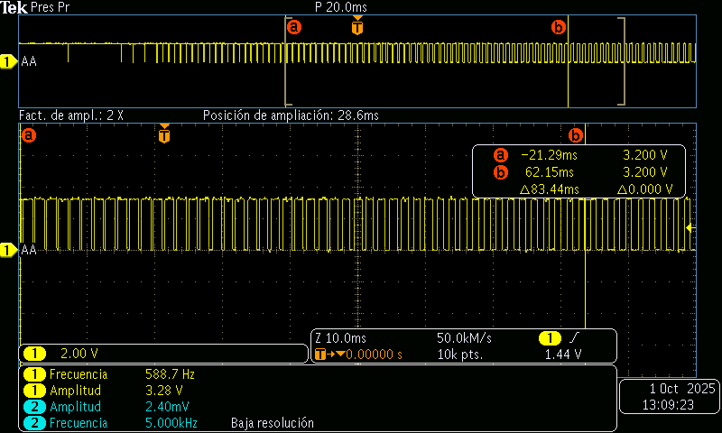
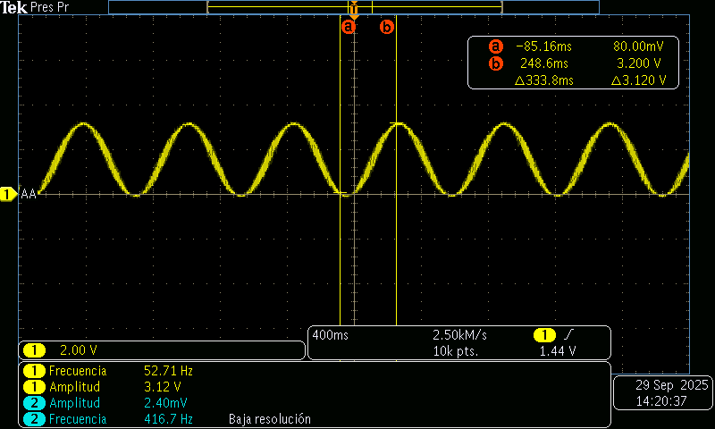

# 〰️ Generación de Señales — Senoidal de 60 Hz con PWM + Filtro RC
> Selene Román Celis - 01/10/2025 

## Qué debe hacer

- Generar una señal sinusoidal aproximada de 60 Hz variando el duty cycle del PWM según una función seno.

- Construir un filtro RC pasabajos básico y verificar la señal en el osciloscopio

```C++ 
#include "pico/stdlib.h"
#include "hardware/pwm.h"
#include <math.h>  
 
#define LED_PIN 0
#define F_PWM_HZ 100  
#define TOP 1023        // 10 bits de resolución
 
int main() {
    stdio_init_all();
 
    gpio_set_function(LED_PIN, GPIO_FUNC_PWM);
    uint slice = pwm_gpio_to_slice_num(LED_PIN);
    uint chan  = pwm_gpio_to_channel(LED_PIN);
 
    // Calcular divisor
    float f_clk = 125000000.0f; // 125 MHz
    float div = f_clk / (F_PWM_HZ * (TOP + 1));
    pwm_set_clkdiv(slice, div);
    pwm_set_wrap(slice, TOP);
 
    pwm_set_chan_level(slice, chan, 0);
    pwm_set_enabled(slice, true);
 
    float theta = 0.0f;
    float dtheta = 0.05f;  
 
    while (true) {
    
        float s = (sinf(theta) + 1.0f) * 0.5f;
        int level = (int)(s * TOP);
 
        pwm_set_chan_level(slice, chan, level);
 
        theta += dtheta;
        if (theta > 2.0f * M_PI) {
            theta -= 2.0f * M_PI;
        }
 
        sleep_ms(5); 
    }
}
```
**Valores para un fc≈100Hz**
- R=1.6 kΩR 
- C=1 μF  

## Osciloscopio sin Filtro


## Osciloscopio con Filtro

