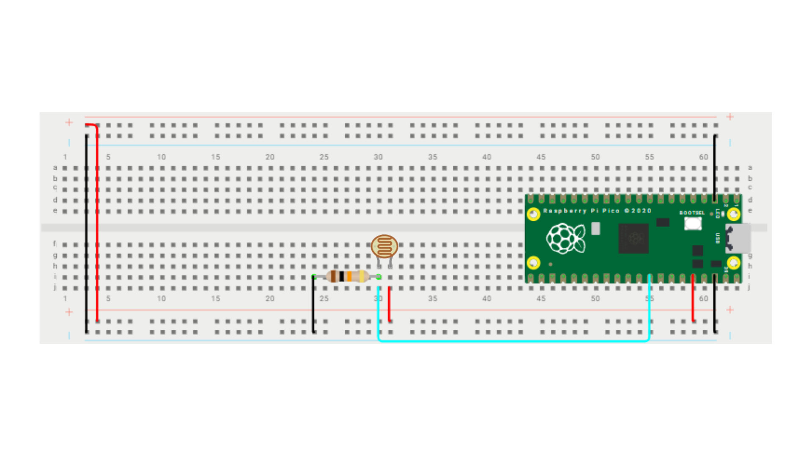

# 🔦 ADC Lúxometro
> Selene Román Celis - 03/11/2025 

## Qué debe hacer

Crear un codigo que me marca la luminosidad de 0-100% usando un LDR

## Código

```C++
#include <stdio.h>
#include "pico/stdlib.h"
#include "hardware/adc.h"

#define ADC_INPUT 1   
#define N_muestras 16       

int main() {
    stdio_init_all();
    adc_init();
    adc_gpio_init(27); 
    adc_select_input(ADC_INPUT);

    uint16_t buffer[N_muestras];
    uint32_t sum = 0;
    uint8_t indice = 0;
    uint8_t cuenta = 0;

    while (true) {
        uint16_t adc = adc_read(); 
        if (cuenta < N_muestras) {
            buffer[indice] = adc;
            sum += adc;
            cuenta++;
            indice++;
        } else {
            sum -= buffer[indice];
            buffer[indice] = adc;
            sum += adc;

            indice++;
            if (indice >= N_muestras) indice = 0;

            uint16_t promedio = sum / N_muestras;

            float porcentaje = (promedio * 100.0f) / 4095;

            printf("Luz: %u%%\n", (int)porcentaje);

            sleep_ms(200);
        }
    }
}
```

## Esquema


## Video
<iframe width="560" height="315" src="https://www.youtube.com/embed/zQwdCeyAwpM?si=GvgXsrT__pItX8cy" title="YouTube video player" frameborder="0" allow="accelerometer; autoplay; clipboard-write; encrypted-media; gyroscope; picture-in-picture; web-share" referrerpolicy="strict-origin-when-cross-origin" allowfullscreen></iframe>